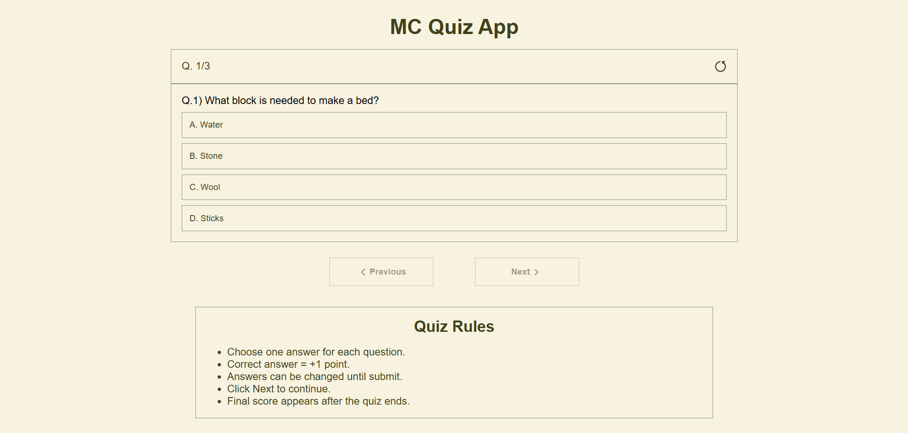
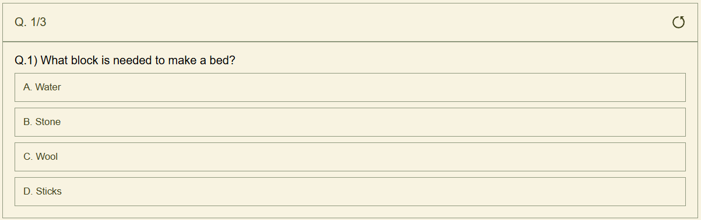
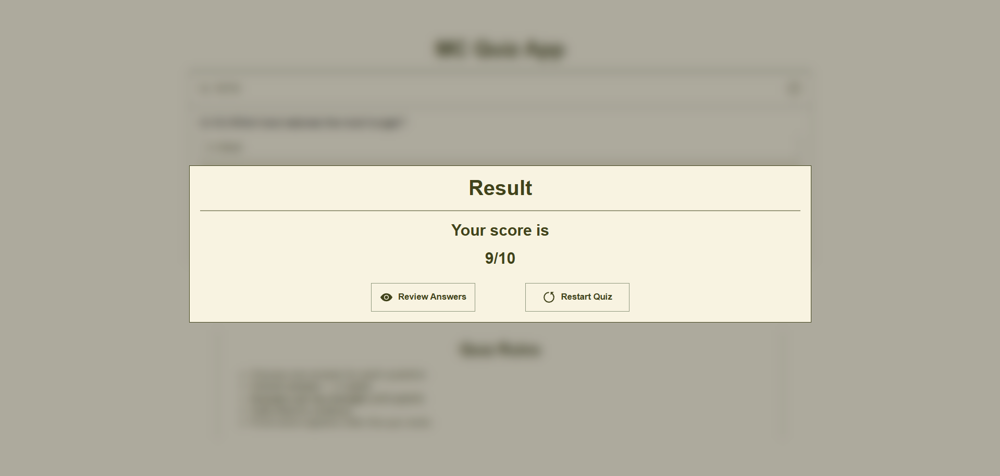
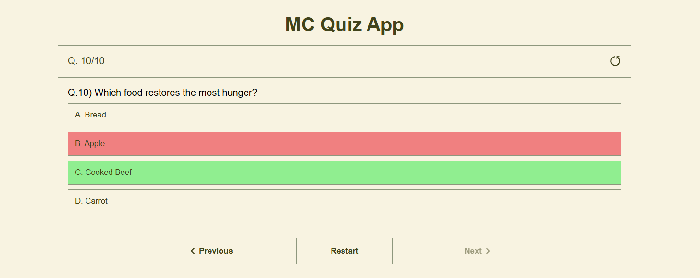

# Quiz App 

A responsive MCQ Quiz App built using React.js.

---

## Features

- 10 quiz questions
- Previous & Next navigation
- Score tracking system
- Review answers mode
- Correct/Wrong answer highlighting
- Result screen with final score
- Restart quiz functionality
- Responsive UI
- LocalStorage support
- Component-based architecture
- Stats updates without refresh

---

## Tech Stack

- React.js
- JavaScript (ES6)
- CSS3
- React Icons

---

##  Screenshots

### Main Screen



---

### Question Display



---

### Result Screen



---

### Review Answers Mode



---

## Project Structure

```bash
src/
│
├── components/
│   ├── NavButtons.jsx
│   ├── Question.jsx
│   ├── Result.jsx
│   ├── Rules.jsx
│   └── Stats.jsx
│
├── data/
│   └── questions.js
│
├── App.jsx
├── App.css
├── index.css
└── main.jsx